# TCGA LUAD — Multi-Modal Survival Analysis & Trial Emulation

End-to-end survival, biomarker, and causal inference analysis of lung adenocarcinoma 
using the TCGA Pan-Cancer Atlas 2018 dataset, integrating clinical, somatic mutation, 
transcriptomic data, and treatment timelines.

## Overview

Lung adenocarcinoma (LUAD) is the most common subtype of non-small cell lung cancer. 
This project analyzes overall survival across clinical and molecular dimensions, 
combining classical biostatistical methods with genomic biomarker analysis, 
multimodal machine learning, and causal inference via trial emulation — reflecting 
real-world evidence (RWE) methodology used in oncology research.

All data sourced from cBioPortal (publicly available). No PHI involved.

## Dataset

**Source:** [cBioPortal — TCGA LUAD Pan-Cancer Atlas 2018](https://www.cbioportal.org/study/summary?id=luad_tcga_pan_can_atlas_2018)  
**Patients:** 505 with complete survival data (566 total, 61 excluded — missing OS)  
**Median OS:** 49.3 months  
**OS event rate:** 36.0% (182/505)  
**Data types:** Clinical, somatic mutations, TMB, MSI, copy number (arm-level), RNA-seq (20,531 genes), treatment timelines

---

## Notebook 01 — Clinical & Genomic Survival Analysis (`notebooks/01_eda.ipynb`)

### 1. Overall Survival
Kaplan-Meier estimate for the full cohort. Median OS ~49 months with long-term 
survivors beyond 200 months.

### 2. Survival by Pathologic Stage
Strong stage-dependent separation (log-rank p=1.38e-12). Stage I patients show 
dramatically better long-term survival. Notable crossing of Stage III and IV curves 
early (~10 months), potentially reflecting more aggressive treatment in Stage III.

### 3. Tumor Mutational Burden (TMB)
TMB stratified by FDA clinical threshold (≥10 mut/Mb): 179 high, 326 low. 
No significant overall survival difference (p=0.249), consistent with TCGA data 
predating widespread immunotherapy use. Visual separation emerges after ~50 months, 
suggesting TMB may be more relevant as a predictive biomarker for immunotherapy 
response than as a general prognostic factor.

### 4. Microsatellite Instability (MSI)
Only 3/504 patients (0.6%) meet MSI-High threshold (≥3.5) — consistent with LUAD 
being predominantly microsatellite stable. MSI is not a clinically actionable 
stratification factor in this cohort.

### 5. Driver Mutation Prevalence
Somatic mutation data analyzed for 9 clinically relevant genes:

| Gene | Patients mutated | Prevalence |
|------|-----------------|------------|
| TP53 | 262 | 51.9% |
| KRAS | 155 | 30.7% |
| KEAP1 | 96 | 19.0% |
| STK11 | 75 | 14.9% |
| EGFR | 70 | 13.9% |
| BRAF | 41 | 8.1% |
| ALK | 39 | 7.7% |
| ROS1 | 31 | 6.1% |
| MET | 21 | 4.2% |

Prevalences are consistent with published LUAD literature, validating data quality.

### 6. Survival by Driver Mutation (EGFR and KRAS)
EGFR-mutated patients show a trend toward worse overall survival, with no patients 
surviving beyond 120 months vs. long-term survivors in the wild-type group — 
not reaching significance (p=0.197) likely due to limited power (n=70). 
This may reflect TCGA predating widespread third-generation TKI use (osimertinib).

KRAS survival curves cross multiple times (p=0.327), indicating heterogeneity 
within the KRAS-mutated group. KRAS comprises multiple subtypes (G12C, G12V, G12D) 
with distinct biology — explored in analyses 7 and 8.

### 7. KRAS Subtype Analysis (G12C, G12V, G12D)
Survival analysis stratified by KRAS mutation subtype.

- **No significant survival difference across KRAS subtypes** (log-rank p = 0.2275) — 
  consistent with KRAS being a **predictive** (not prognostic) biomarker; 
  subtype-specific therapies (sotorasib for G12C) postdate TCGA data collection
- **G12V shows best survival among KRAS-mutated subtypes** — tracks closely 
  with WT throughout follow-up
- **G12C shows faster early mortality** than WT despite similar overall event 
  rates — KM curve shape reveals what crude mortality rates miss
- **G12D has highest overall mortality (44.4%)** — consistent with emerging 
  evidence of more aggressive biology

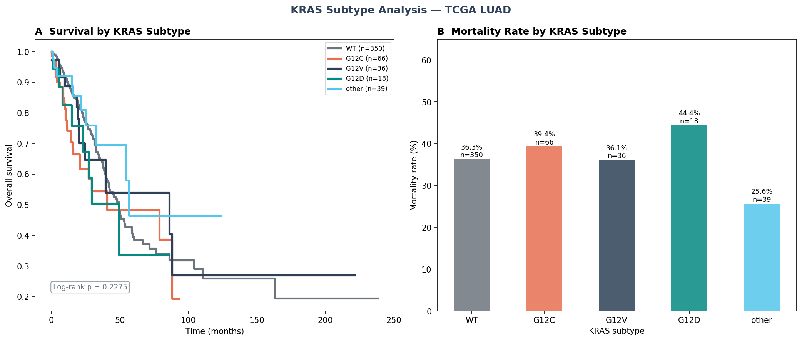

### 8. KRAS Co-mutation Analysis (KRAS + STK11, KRAS + KEAP1)
Survival analysis within KRAS-mutated patients stratified by co-occurring mutations.

- **KRAS only has the best survival (30.3% mortality)** — co-mutations add 
  adverse biological complexity
- **KRAS + KEAP1 has the highest mortality (55.0%)** — suggesting KEAP1 
  co-mutation has a stronger adverse effect than STK11 in this cohort
- **KRAS + STK11 curve reaches 0 at ~54 months** — not because all patients 
  died (41.7% mortality), but because no patients remain at risk beyond that 
  point (n=0 at t=75mo in risk table)
- Results are directionally consistent with published literature but do not 
  reach significance (p=0.2146) due to small group sizes (n=16–24)

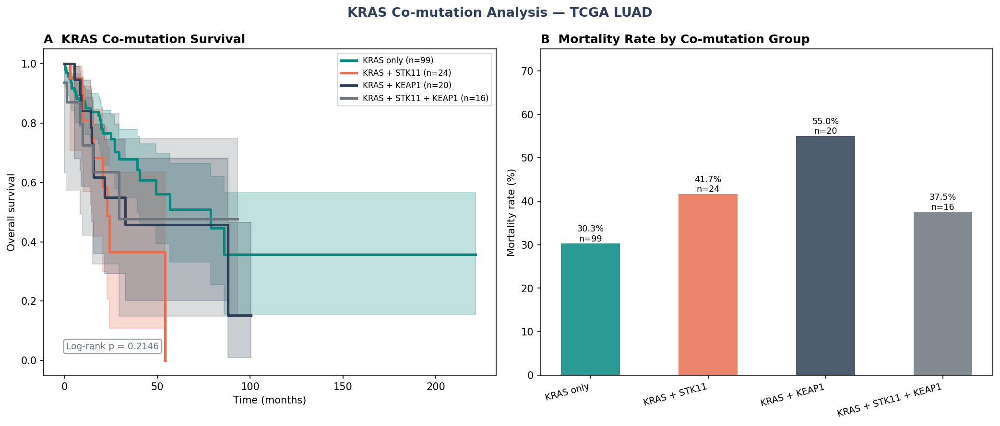

### 9. Multivariable Cox Proportional Hazards Model
Integrating clinical (age, stage) and molecular features (driver mutations, TMB, aneuploidy).

- **STK11 mutation has the highest hazard ratio (HR=1.67, p=0.01)** — 
  largest effect size, consistent with its role in immune evasion and 
  therapy resistance
- **Stage is the most statistically robust prognostic factor** (HR=1.46, 
  p<0.005) — most precisely estimated due to larger group sizes
- **TP53 mutation is independently prognostic** (HR=1.39, p=0.03) — 
  effect holds after controlling for stage and co-mutations
- **TMB and Aneuploidy are not prognostic** (HR=1.00) — consistent with 
  their role as predictive rather than prognostic biomarkers
- **C-index: 0.707** — good discriminative ability for a clinical + 
  molecular model

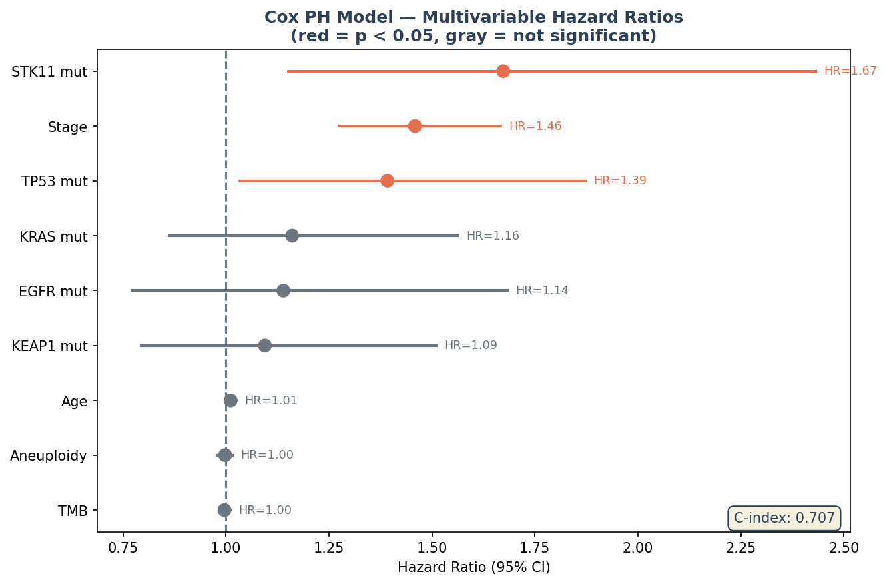

### 10. ML-Based Prediction of 2-Year Mortality
Binary classification integrating clinical and molecular features.

- **Logistic Regression achieves best AUC (0.775)** — outperforming 
  Random Forest (0.743) and Gradient Boosting (0.645); simpler models 
  generalize better with limited sample size
- **Stage is the dominant predictive feature** — all other features have 
  importance near zero with wide CIs reflecting limited test set size
- **STK11 permutation importance is near zero** despite Cox significance — 
  illustrating that Cox and permutation importance capture different 
  aspects of feature relevance

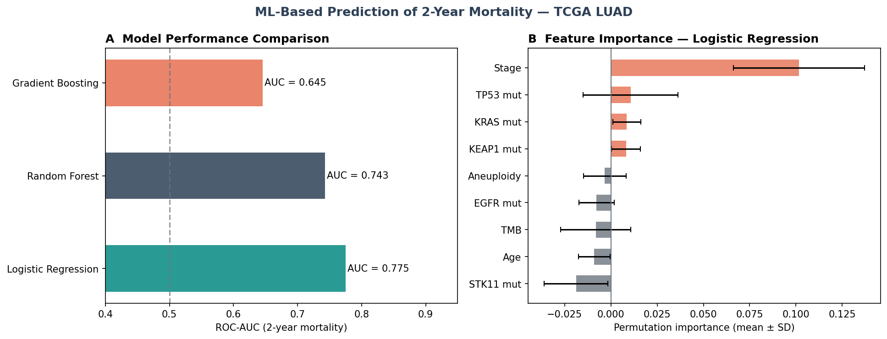

---

## Notebook 02 — Multimodal Survival Analysis: Clinical + RNA-seq (`notebooks/02_multimodal_survival.ipynb`)

Integration of RNA-seq gene expression (20,531 genes) with clinical features 
to build multimodal survival models.

**Data processing:** Top 1,000 most variable genes (median expression > 1) → 
PCA dimensionality reduction (5 components, 29.2% variance explained) → 
merged with clinical data (n=497 patients with complete multimodal data)

### PCA of Gene Expression
No clear separation by survival outcome in PC1-PC2 space — variance highly 
distributed across components, typical of RNA-seq data.

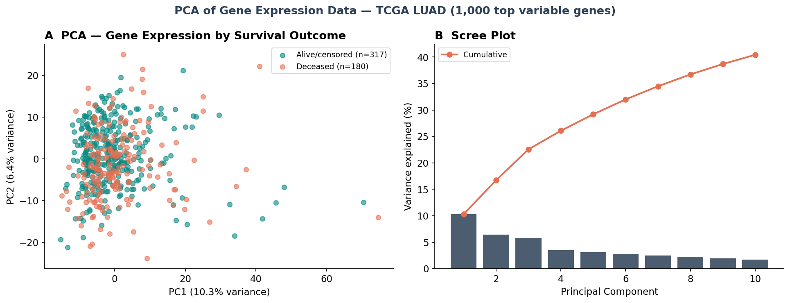

### Multimodal Cox Model Comparison

| Model | C-index (fitted) | C-index (5-fold CV) | Uno C-index (95% CI) |
|---|---|---|---|
| Clinical only | 0.696 | 0.675 | 0.696 (0.654–0.745) |
| Expression only | 0.644 | 0.640 | 0.644 (0.607–0.700) |
| Multimodal | 0.714 | 0.694 | 0.714 (0.674–0.769) |

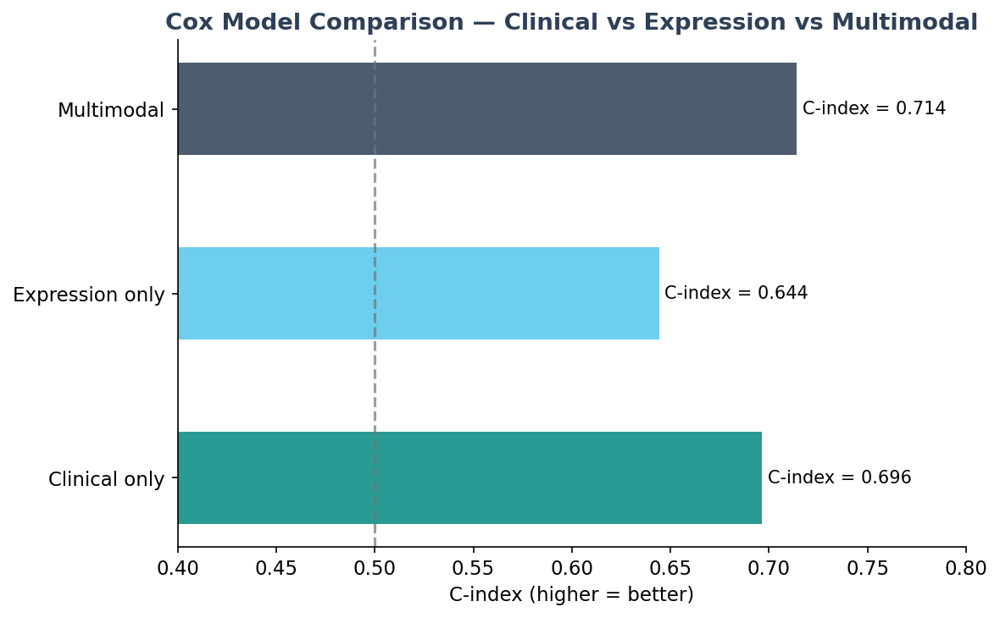
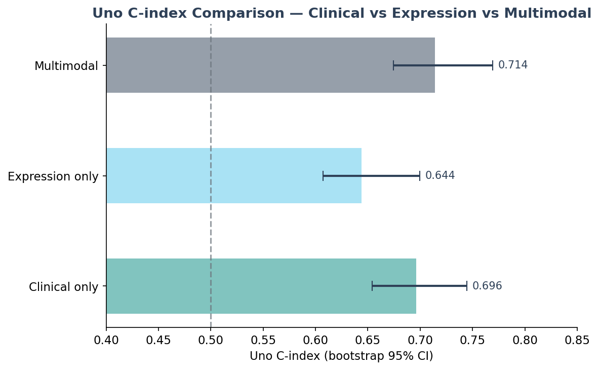

### Formal Statistical Testing
- **DeLong test** (AUC comparison): p=0.32 — no significant difference
- **Uno C-index** with bootstrap 95% CI — overlapping CIs confirm no 
  significant improvement from adding transcriptomic data

**Key finding:** Multimodal integration shows a consistent trend toward 
improvement (+0.018 C-index) but does not reach statistical significance 
in this cohort (n=497, 180 events). Stage remains the dominant prognostic 
factor. A larger cohort would be needed to confirm transcriptomic added value.

### Prognostic Gene Analysis

**Univariable Cox for 1,000 genes** (log2-transformed, FDR-corrected):
- 218 genes significant at p<0.05
- **50 genes significant after Benjamini-Hochberg FDR correction**
- 30 adverse (high expression = worse survival)
- 20 protective (high expression = better survival)

**Top adverse genes:** ERO1L (HR=1.30), LDHA (HR=1.48), KRT6A (HR=1.07)  
**Top protective genes:** SFTA3 (HR=0.90), NKX2-1 (HR=0.89), CXCL17 (HR=0.90)

All top genes are biologically plausible and consistent with published LUAD 
literature — validating the analytical approach.

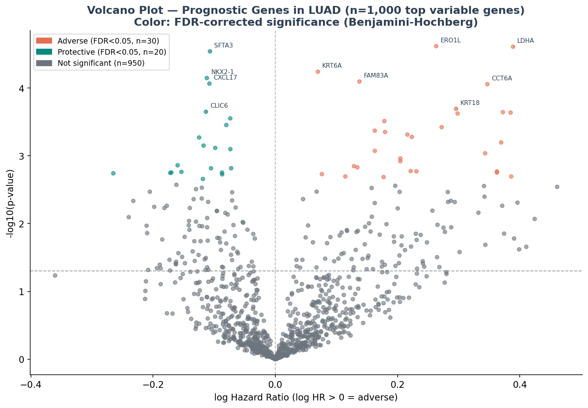
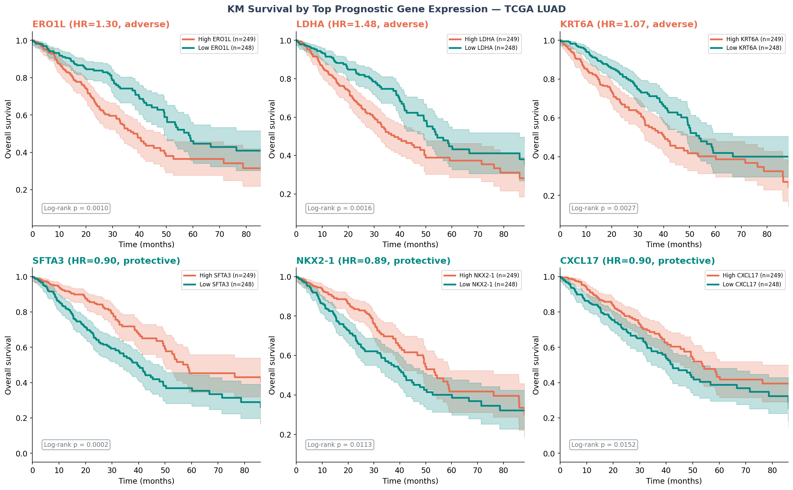

**Optimal cutpoint analysis** (ERO1L, LDHA, SFTA3):

| Gene | Median p | Optimal p | Improvement |
|---|---|---|---|
| ERO1L | 9.67e-04 | 2.73e-07 | 3,540x |
| LDHA | 1.60e-03 | 3.33e-06 | 470x |
| SFTA3 | 1.65e-04 | 8.28e-06 | 20x |

Optimal cutpoint identifies biologically distinct high-risk subgroups — 
ERO1L high-risk group comprises only 17% of patients (n=87), not 50% 
as median split assumes. Visual curve separation is substantially larger 
with optimal cutpoint for ERO1L and LDHA.

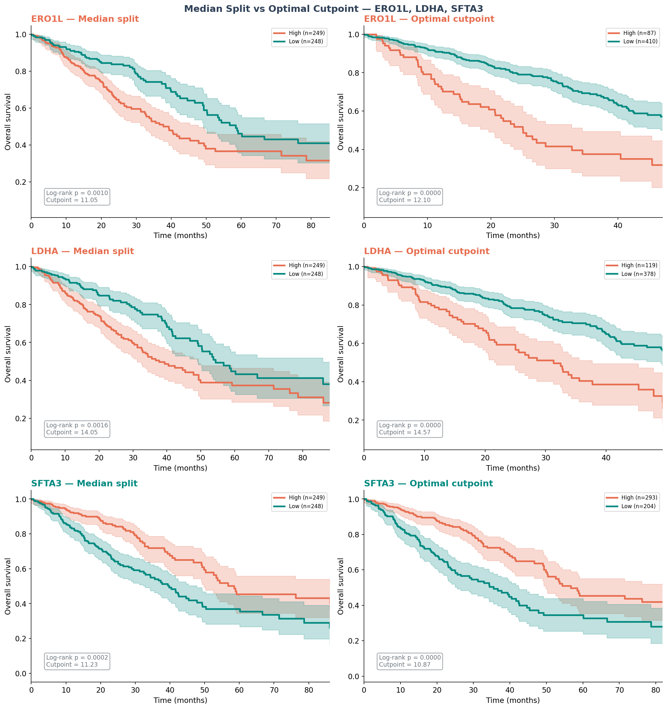

---

## Notebook 03 — Trial Emulation: Causal Effect of Adjuvant Chemotherapy (`notebooks/03_trial_emulation.ipynb`)

Emulation of a target trial to estimate the causal effect of adjuvant chemotherapy 
on overall survival in resected LUAD (Stage I–III), following the target trial 
emulation framework (Hernán & Robins, 2016). Propensity score matching (PSM) and 
inverse probability weighting (IPW) are used to address confounding by indication.

**Cohort:** 188 patients with treatment records (Stage I–III) | 154 chemo, 34 no chemo  
**Event rate:** 42.6% (80/188) | **Data source:** TCGA treatment timeline + clinical data

### Target Trial Protocol

| Component | Specification |
|---|---|
| Eligibility | LUAD, Stage I–III, with treatment record in TCGA timeline |
| Treatment | Adjuvant chemotherapy (yes vs no) |
| Outcome | Overall survival — time from diagnosis to death |
| Causal contrast | Intention-to-treat analogue |
| Analysis | Cox PH model adjusted via PSM and IPW |

### Confounding by Indication
Treatment records are available for 204/571 patients (35.7%). Within the eligible 
cohort, chemotherapy is preferentially administered to younger patients with more 
advanced disease — the classic confounding-by-indication structure in oncology RWE.

| | Chemotherapy (n=154) | No Chemotherapy (n=34) |
|---|---|---|
| Stage I | 23.4% | 73.5% |
| Stage II | 44.2% | 8.8% |
| Stage III | 32.5% | 17.6% |
| Median age | 64.5 years | 70.0 years |

### Propensity Score Model
Logistic regression on age, stage, sex, TMB, aneuploidy, and driver mutations 
(TP53, KRAS, STK11, KEAP1, EGFR). **AUC = 0.828** — confirming strong separation 
consistent with substantial confounding.

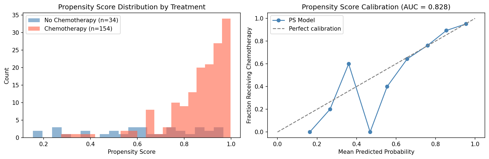

### Covariate Balance — Love Plot
PSM achieves SMD < 0.1 for 8 of 10 covariates. Stage (SMD: 0.849 → 0.13) and 
age (SMD: 0.530 → 0.09) show the largest improvements after matching.

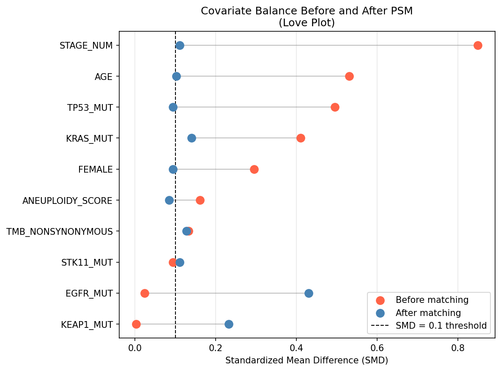

### Survival Analysis Results

| Method | HR | 95% CI | p-value | N |
|---|---|---|---|---|
| Naive (unadjusted) | 0.55 | 0.34–0.89 | 0.015 | 188 |
| PSM-adjusted | 0.31 | 0.10–0.93 | 0.037 | 44 |
| IPW-adjusted | 0.37 | 0.22–0.64 | <0.001 | 188 |

All three estimators show a consistent direction of effect. IPW is the preferred 
estimator — it uses the full cohort, produces narrower confidence intervals, and 
avoids patient loss from caliper restrictions. PSM and IPW consistency strengthens 
confidence in the causal direction.

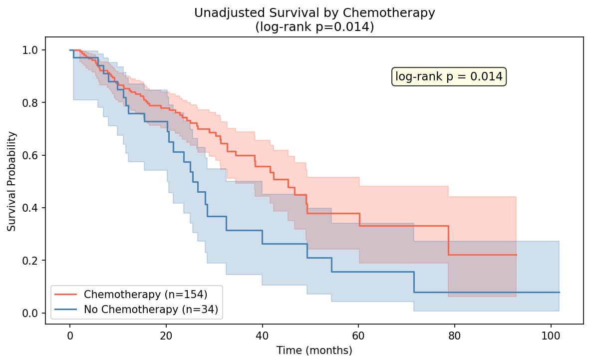
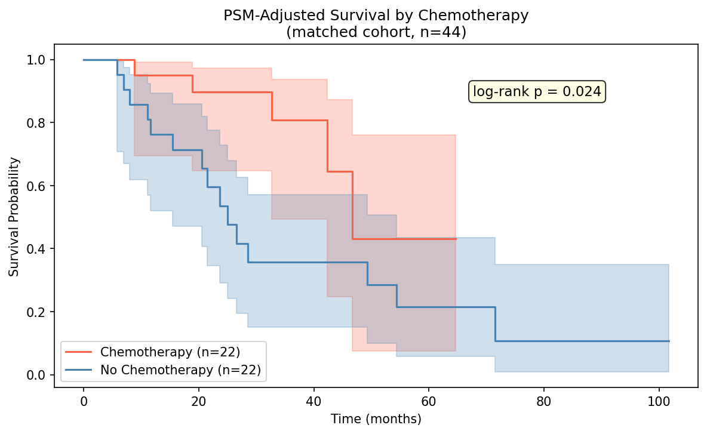
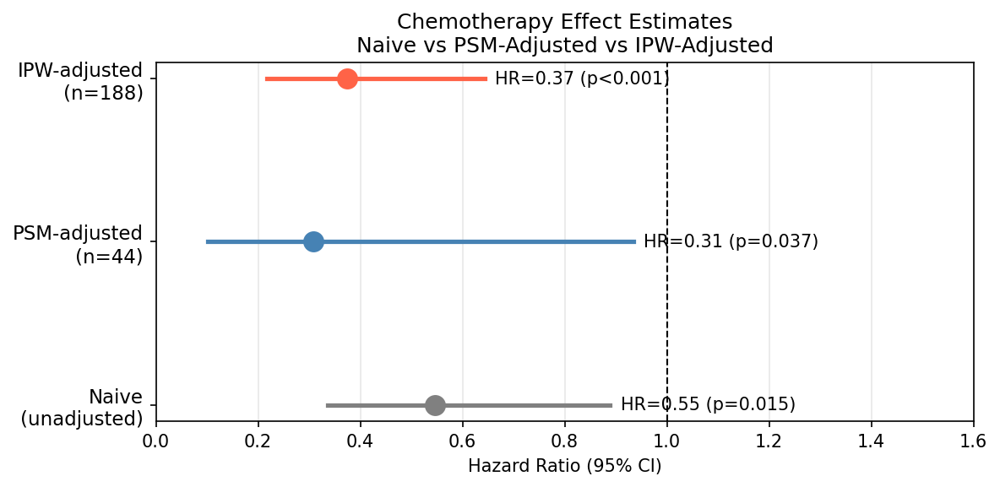

### Sensitivity Analysis — E-value
The E-value (VanderWeele & Ding, 2017) quantifies robustness to unmeasured confounding.

| | HR | E-value |
|---|---|---|
| Point estimate | 0.374 | 4.79 |
| CI lower bound | 0.218 | 8.64 |

An unmeasured confounder would need to be associated with both chemotherapy receipt 
and mortality by a risk ratio of at least **4.79-fold each** to fully explain away 
the observed effect — approximately 3× stronger than the largest measured confounder 
(pathologic stage). This supports the robustness of the finding.

### Subgroup Analysis by Pathologic Stage

IPW-adjusted Cox models fit separately within each stage subgroup.

| Stage | N | Chemo | Control | HR | 95% CI | p-value |
|---|---|---|---|---|---|---|
| Stage I | 61 | 36 | 25 | 0.39 | 0.16–0.95 | 0.037 |
| Stage II | 71 | 68 | 3 | 1.10 | 0.08–>5.00 | 0.944 |
| Stage III | 56 | 50 | 6 | 0.44 | 0.23–0.82 | 0.010 |

Stage III shows the most reliable estimate (HR=0.44, p=0.010), consistent with
randomized trial evidence. Stage II is uninformative due to only 3 control patients.
Stage I shows an unexpected benefit signal likely attributable to residual
confounding — chemotherapy is not standard of care in Stage I LUAD.

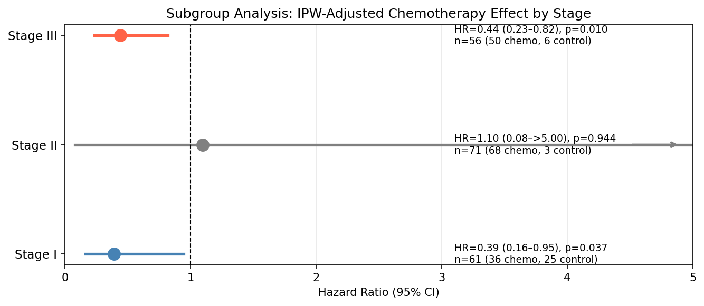

### Key Findings
- Chemotherapy is associated with improved OS across all estimators (HR 0.31–0.55)
- Confounding by indication is clearly demonstrated and successfully addressed
- IPW (HR=0.37, p<0.001) is the primary causal estimate; PSM (HR=0.31, p=0.037) is confirmatory
- E-value of 4.79 indicates the finding is robust to unmeasured confounding of plausible magnitude

### Limitations
- Treatment records available for only 35.7% of patients — potential selection bias
- Small control group (n=34) limits PSM statistical power (22 matched pairs)
- TCGA predates modern immunotherapy and targeted therapy combinations
- Unmeasured confounders (performance status, comorbidities) not captured in TCGA data

---

## Notebook 04 — Gradient Boosting Survival Analysis (`notebooks/04_gradient_boosting_survival.ipynb`)

Tree-based survival analysis using `GradientBoostingSurvivalAnalysis` (scikit-survival),
benchmarked against Cox PH on the same clinical and molecular features.

**Cohort:** 485 patients | 172 events (35.5%) | 10 features  
**Split:** 75% train / 25% test | 5-fold cross-validation

### Model Comparison

| Model | CV C-index | Test C-index |
|---|---|---|
| Cox PH baseline | 0.682 ± 0.056 | 0.767 |
| Gradient Boosting Survival | 0.646 ± 0.050 | 0.711 |

Cox PH outperforms Gradient Boosting Survival in cross-validation — consistent
with the pattern observed in Notebook 01 where simpler models generalize better
at this sample size. Gradient boosting is expected to gain advantage in larger
datasets where non-linear feature interactions can be reliably estimated.

### Feature Importance

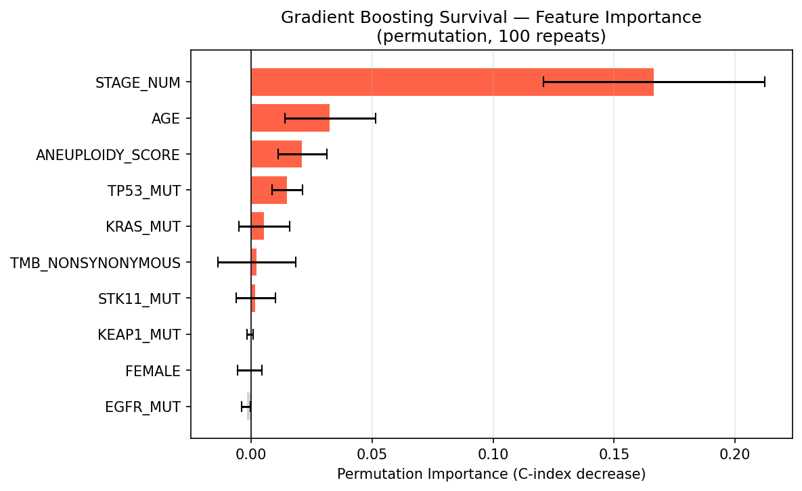

Stage is the overwhelmingly dominant predictor (importance=0.17). AGE and
ANEUPLOIDY_SCORE are secondary contributors. STK11 — the strongest prognostic
factor in the Cox model (HR=1.67, p=0.01) — shows near-zero permutation
importance, illustrating the fundamental distinction between Cox effect size
and predictive contribution.

### Cross-Project Model Comparison

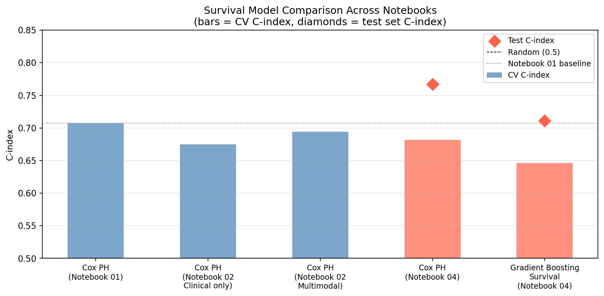

Across all four notebooks, Cox PH achieves the best cross-validated C-index.
Stage dominates all models — the ceiling on C-index reflects the limited number
of features that independently predict survival beyond pathologic stage in TCGA LUAD.

### Key Findings
- Cox PH (CV C-index 0.682) outperforms Gradient Boosting Survival (0.646)
- Stage > Age > Aneuploidy as predictive features — consistent across all models
- STK11 prognostic significance (Cox) does not translate to predictive importance (GBS)
- Non-linear methods require larger datasets to outperform linear survival models

### Limitations
- Default hyperparameters used — grid search not performed
- Small sample size limits gradient boosting's capacity for non-linear learning
- No external validation cohort available

---

## Stack

- **Python, pandas** — data ingestion and processing
- **lifelines** — Kaplan-Meier, Cox PH, log-rank tests
- **scikit-survival** — Uno C-index, formal survival model comparison, Cox PH, Gradient Boosting Survival
- **scikit-learn** — ML prediction, PCA, permutation importance, propensity score model
- **Matplotlib** — visualizations
- **Jupyter** — documented analysis notebooks

## Project Structure

```
tcga-luad-rwe/
├── data/
│   ├── raw/                                # cBioPortal source files (not tracked in git)
│   └── processed/                          # cleaned datasets (not tracked in git)
├── notebooks/
│   ├── 01_eda.ipynb                        # clinical & genomic survival analysis
│   ├── 02_multimodal_survival.ipynb        # RNA-seq integration & multimodal models
│   ├── 03_trial_emulation.ipynb            # causal inference & trial emulation
│   ├── 04_gradient_boosting_survival.ipynb # gradient boosting survival analysis
│   └── figures/                            # saved plots
├── src/
│   └── ingest.py                            # data ingestion and cleaning
├── requirements.txt
├── .gitignore
└── README.md
```

## Setup

```bash
pyenv virtualenv 3.11 luad
pyenv activate luad
pip install -r requirements.txt
python src/ingest.py
jupyter notebook
```

---

**Author:** Raquel (Kely) Norel, PhD  
**Domain:** Oncology / Real-World Evidence / Causal Inference  
**Status:** ✅ Complete
